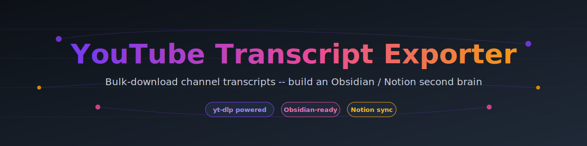
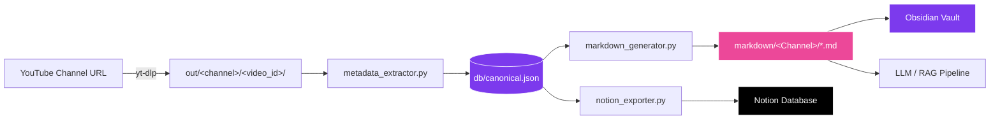

<div align="center">



<p>
<a href="https://github.com/dlovecreator-arch/youtube-transcript-exporter/actions/workflows/ci.yml"></a>
<a href="LICENSE"></a>
<a href="#"></a>
<a href="#"></a>
<a href="#"></a>
<a href="#"></a>
<a href="https://github.com/dlovecreator-arch/youtube-transcript-exporter/stargazers"></a>
</p>

<p><strong>Bulk-export YouTube transcripts + metadata into a clean local dataset you can search, analyze, and feed into any workflow (Obsidian, Notion, RAG, research).</strong></p>

<p>
<a href="QUICKSTART.md">⚡ Quick Start</a> -
<a href="INSTALL.md">📦 Install</a> -
<a href="API.md">📚 API Docs</a> -
<a href="TROUBLESHOOTING.md">🔧 Help</a> -
<a href="PRODUCTION_READINESS.md">✅ Production Ready</a>
</p>

</div>

---

## 📖 Documentation

This project is built for production use. Start here:

| Document | Purpose |
|----------|---------|
| [**QUICKSTART.md**](QUICKSTART.md) | Get up and running in 5 minutes |
| [**INSTALL.md**](INSTALL.md) | Detailed installation guide |
| [**API.md**](API.md) | Programmatic usage & examples |
| [**TROUBLESHOOTING.md**](TROUBLESHOOTING.md) | Solve common problems |
| [**PRODUCTION_READINESS.md**](PRODUCTION_READINESS.md) | Enterprise-grade standards met |
| [**CONTRIBUTING.md**](CONTRIBUTING.md) | Help improve this project |

Internal/maintenance notes are kept in [`docs/reports/`](docs/reports/) to keep the repo top-level clean.

---

## Why this exists

You watch a lot of YouTube. Across 10+ channels, the same ideas, guests, and frameworks come up over and over. But you can't search across them. You can't ask _"every time Joe Rogan, Lex, and Huberman talked about sleep"_. You can't even quote them properly.

This tool turns YouTube channels into a **searchable, structured dataset** you can:

- read like a library (Markdown)
- analyze like a database (canonical JSON)
- index for semantic search / RAG
- optionally sync into tools like Obsidian or Notion

Notion and Obsidian integrations are **optional exporters**, not requirements.

## Who this is for

- Researchers and students building a literature review from long-form content
- Journalists and analysts creating a quoteable archive
- Creators and teams monitoring topics/guests across channels
- Engineers building RAG datasets from public video transcripts
- Anyone building a personal "second brain" from YouTube

Run one command per channel:

```bash
./export.sh --full-pipeline https://www.youtube.com/@SomeChannel
```

You get clean transcripts, structured metadata (guest, tags, date, views), and a single canonical database that links the same video appearing on multiple channels.

---

## ⚡ Quickstart

### Prerequisites

- **macOS / Linux** (Windows works via WSL)
- **Python 3.10+**
- **[yt-dlp](https://github.com/yt-dlp/yt-dlp)** (`brew install yt-dlp` or `pip install yt-dlp`)

### 60-second setup

```bash
# 1. Clone
git clone https://github.com/dlovecreator-arch/youtube-transcript-exporter.git
cd youtube-transcript-exporter

# 2. (Optional) Bring your channel list
cp channels.txt.example channels.txt
# add your channels, one URL per line

# 3. Process your first channel
./export.sh --full-pipeline https://www.youtube.com/@LexFridman

# 4. Open the vault in Obsidian
open markdown/
```

That's it. You now have hundreds of `.md` files with YAML frontmatter, ready for Obsidian's Dataview, Notion's database import, or any LLM pipeline.

---

## 🎁 What you get

After one `--full-pipeline` run on a channel:

| Path                              | What it is                                         |
|-----------------------------------|----------------------------------------------------|
| `out/<Channel>/<video_id>/`       | Raw downloads (`.info.json`, `.en.vtt`, transcript)|
| `db/canonical.json`               | Single source of truth -- every video, every channel |
| `markdown/<Channel>/...md`        | Obsidian-ready markdown with YAML frontmatter      |
| `markdown/_start_here.md`         | Auto-generated global index                        |
| `markdown/<Channel>/_index.md`    | Auto-generated per-channel index                   |

### Sample output file

```yaml
---
id: dQw4w9WgXcQ
title: "How AI Will Change Everything"
channel: "Lex Fridman"
guest: "Sam Altman"
guest_confidence: 0.95
date: 2025-01-15
duration_seconds: 9842
views: 4500000
likes: 78000
tags: [ai, agi, openai, future]
url: https://youtu.be/dQw4w9WgXcQ
word_count: 41203
reading_time_minutes: 206
---

# How AI Will Change Everything

(full cleaned transcript text here)
```

See [`docs/example_output.md`](docs/example_output.md) for a complete sample.

---

## 🏗 How it works



### The four phases

1. **Download** -- `yt-dlp` pulls captions and metadata into `out/<channel>/<video_id>/`. Folders are always named by the 11-character YouTube id (titles change; ids never do).
2. **Extract** -- a Python pass reads every `.info.json` and produces `db/canonical.json`: a single, deduplicated list of every video across every channel, with guests/tags inferred via heuristics.
3. **Generate** -- `markdown_generator.py` reads the canonical DB and writes one clean `.md` file per video, with full YAML frontmatter and a deduplicated transcript body.
4. **Audit** -- `--audit` re-validates the layout and reports anything that drifted from the rules in [`CONVENTIONS.md`](CONVENTIONS.md).

Every step is **idempotent**: re-running on existing data is a no-op.

---

## 📚 Commands

```bash
./export.sh --help
```

| Command                                   | What it does                                       |
|-------------------------------------------|----------------------------------------------------|
| `./export.sh --full-pipeline <URL>`       | Download + metadata + markdown + audit (the usual) |
| `./export.sh --new-channel <URL>`         | Only download                                      |
| `./export.sh --rebuild-metadata`          | Rebuild `db/canonical.json` from `out/`            |
| `./export.sh --rebuild-markdown`          | Rebuild `markdown/` from `db/canonical.json`       |
| `./export.sh --audit`                     | Print quality + layout audit                       |
| `./export.sh --export-notion [--max N]`   | Push to Notion (needs `NOTION_TOKEN`)              |

### Export to Notion

```bash
export NOTION_TOKEN="secret_xxx"             # from https://www.notion.so/my-integrations
export NOTION_DATABASE_ID="xxx"              # your destination database
./export.sh --export-notion
```

### Use with Obsidian

```bash
# Either symlink or copy the vault
ln -s "$(pwd)/markdown" ~/ObsidianVaults/YouTube
# Then open in Obsidian and install the Dataview plugin to query frontmatter.
```

Try this Dataview query inside Obsidian:

````
```dataview
TABLE channel, guest, date, views
FROM "."
WHERE contains(tags, "consciousness")
SORT views DESC
LIMIT 20
```
````

---

## 🧠 Cross-channel research

The canonical DB tracks the same video appearing on multiple channels (re-uploads, clips, podcast networks). Guests are normalized so a person appearing across 5 channels is a single searchable entity.

```bash
# How many unique guests do you have across all channels?
python3 -c "
import json; d = json.load(open('db/canonical.json'))
guests = {v['guest'] for v in d['videos'] if v.get('guest')}
print(f'Unique guests: {len(guests)}')"
```

---

## 🗂 Repo layout

```
youtube-transcript-exporter/
├── CONVENTIONS.md          # The rules. Read first.
├── README.md               # This file.
├── export.sh               # Single CLI entry point.
├── channels.txt.example    # Template channel list.
├── src/                    # Python scripts.
│   ├── metadata_extractor.py
│   ├── markdown_generator.py
│   ├── obsidian_formatter.py
│   └── notion_exporter.py
├── db/                     # Generated canonical DB (gitignored).
├── out/                    # Raw yt-dlp downloads (gitignored).
├── markdown/               # Generated Obsidian vault (gitignored).
└── docs/                   # Examples + diagrams.
```

The data folders (`out/`, `markdown/`, `db/canonical.json`) are intentionally not committed -- everyone generates their own.

---

## 🛣 Roadmap

- [ ] Auto-summary per video (LLM, optional)
- [ ] Timeline view across channels (`when did they all start talking about X?`)
- [ ] Auto-link guests across channels in markdown via Obsidian wiki-links
- [ ] CI: layout audit on every PR
- [ ] Optional: Whisper fallback for videos without auto-captions

PRs welcome -- see [CONTRIBUTING.md](CONTRIBUTING.md).

---

## ⚠️ Legal & ethical use

- Respect YouTube's terms of service and creators' rights.
- Use this for personal research, study, and accessibility.
- Don't republish full transcripts at scale without permission.
- yt-dlp may rate-limit; the default config sleeps 1.5--3 seconds between videos.

---

## 🙏 Credits

- Built on top of the excellent [yt-dlp](https://github.com/yt-dlp/yt-dlp).
- Architecture inspired by the "single source of truth + idempotent pipeline" philosophy.
- Designed for [Obsidian](https://obsidian.md/) and [Notion](https://notion.so/) users.

---

## 📄 License

[MIT](LICENSE) -- do what you want, just don't blame me.

<div align="center">
<sub>Built with care for fellow infovores. ★ if it helps you.</sub>
</div>
